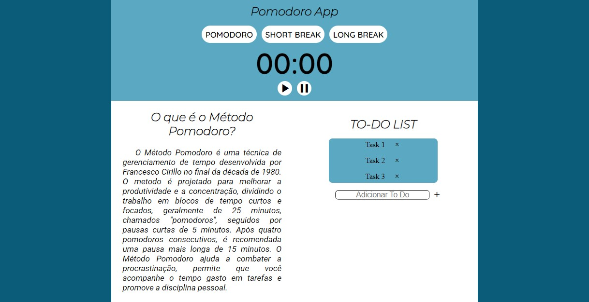

# Study site made with JavaScript
  
 .
 ### App: https://nicolaskleinaraujo.github.io/pomodoro-web/

# About
 This is a simple study website made using JavaScript.
 This website uses "Pomodoro" method and a to-do list that helps in scheduling everyday tasks.
 Pomodoro is a time management technique that allows you to enhance your productivity and concentration.
 Pomodoro Method helps you to combat procrastination while allows you  to see how much time you spend in certain activities.

# Used Tecnologies
 ### Back-end
 - JavaScript

 ### Front-end
 - HTML
 - CSS

 ### Implantation
 - Website: https://nicolaskleinaraujo.github.io/pomodoro-web/

# Author
 Nicolas Klein Faria de Araujo  
 https://nk-portfolio-react.netlify.app
